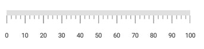

# How-to-customize-the-Xamarin-LinearGauge-label-position
This article explains how to customize the label position in the Xamarin.Forms [SfLinearGauge](https://help.syncfusion.com/xamarin/linear-gauge/getting-started) control, as shown in the following image.



## Change the linear gauge label position

Label position can be changed by setting the LabelOffset property in [SfLinearGauge](https://help.syncfusion.com/cr/xamarin/Syncfusion.SfGauge.XForms.SfLinearGauge.html).

**Step 1:** Create an instance of [SfLinearGauge](https://help.syncfusion.com/cr/xamarin/Syncfusion.SfGauge.XForms.SfLinearGauge.html).

**Step 2:** Add the [LinearScale](https://help.syncfusion.com/cr/xamarin/Syncfusion.SfGauge.XForms.LinearScale.html) into the scales collection of the linear gauge.

**Step 3:** Add the [LabelOffset](https://help.syncfusion.com/cr/xamarin/Syncfusion.SfGauge.XForms.Scale.html#Syncfusion_SfGauge_XForms_Scale_LabelOffset) property to customize the LinearGauge label position.

**[XAML]**
```
<gauge:SfLinearGauge>
    <gauge:SfLinearGauge.Scales>
        <gauge:LinearScale ScaleBarColor="#e0e0e0"
                           LabelColor="#424242"
                           LabelOffset="5">
            <gauge:LinearScale.MajorTickSettings>
                <gauge:LinearTickSettings Thickness="1"
                                          Color="Gray"
                                          Length="15" />
            </gauge:LinearScale.MajorTickSettings>
            <gauge:LinearScale.MinorTickSettings>
                <gauge:LinearTickSettings Thickness="1"
                                          Color="Gray"
                                          Length="7" />
            </gauge:LinearScale.MinorTickSettings>
        </gauge:LinearScale>
    </gauge:SfLinearGauge.Scales>
</gauge:SfLinearGauge>
```

[View the sample in GitHub](https://github.com/SyncfusionExamples/How-to-customize-the-Xamarin-LinearGauge-label-position)

## See also

[How to set the postfix or prefix value for labels in Xamarin.Forms SfLinearGauge](https://help.syncfusion.com/xamarin/linear-gauge/labels#setting-postfix-and-prefix-for-labels)

[How to add multiple scale in Xamarin.Forms SfLinearGauge](https://help.syncfusion.com/xamarin/linear-gauge/scales#multiple-scales)

[How to set the custom-labels for scale in Xamarin.Forms SfLinearGauge](https://help.syncfusion.com/xamarin/linear-gauge/labels#custom-labels)

[How to customize the label visibility in Xamarin.Forms SfLinearGauge](https://help.syncfusion.com/xamarin/linear-gauge/labels#labels-visibility)

[How to customize the scale labels in Xamarin.Forms SfLinearGauge](https://help.syncfusion.com/xamarin/linear-gauge/labels#customize-the-scale-labels)